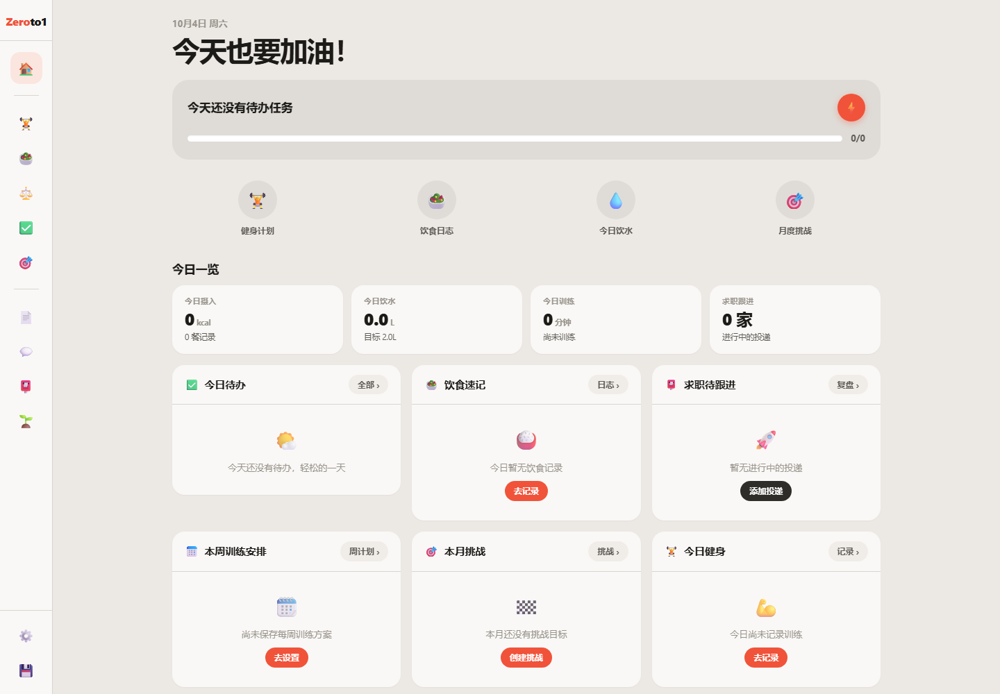
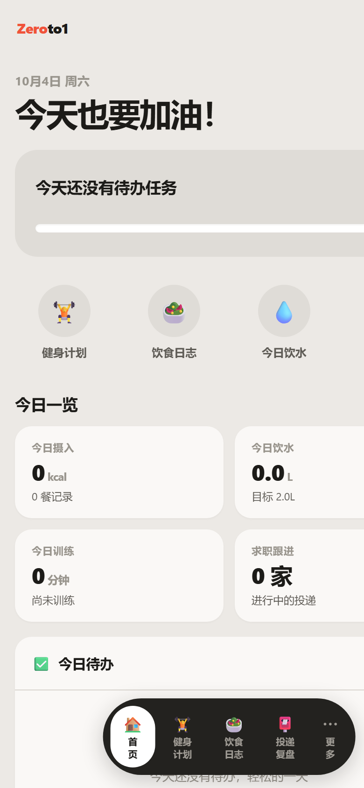

# Zeroto1 · 个人成长工作台

一体化个人成长管理 Web App：**健身饮食自律管理 + 求职发展规划** 两大板块，从 0 到 1 见证每一次成长。

- 🌐 **在线体验**：<https://miaoyudong666six.github.io/Zeroto1/>（手机 / 电脑均可访问，支持"添加到主屏幕"作为 App 使用）
- 📱 移动端优先，响应式布局（手机胶囊底部导航 / 桌面图标侧边栏）
- 🌍 中英文双语界面，一键切换
- 💾 数据保存在浏览器本地，支持 JSON 一键导出 / 导入备份

## 界面预览



<details>
<summary>📱 点击展开移动端界面</summary>



</details>

## 功能总览

| 板块 | 模块 | 能力 |
|---|---|---|
| 🏠 首页 | Dashboard | 今日待办、健身提醒、饮食速记、求职待跟进、周训练安排、本月挑战一览 |
| A · 健身饮食 | 健身计划 | 每日训练录入（项目/部位/组数次数/时长/负重/感受）；保存周方案一键套用 |
| A · 健身饮食 | 饮食日志 | 三餐+加餐录入（食物/热量/时间）、饮水记录、自动生成一周饮食汇总 |
| A · 健身饮食 | 身体数据 | 体重/体脂/睡眠/状态备注，周维度 SVG 曲线回看 |
| A · 健身饮食 | 通用待办 | 每日清单 + 每周固定任务，完成/延后/未完成状态流转 |
| A · 健身饮食 | 月度挑战 | 自主创建目标、挑战细则、每日日历打卡、进度与心得体会 |
| B · 求职发展 | 简历档案 | 多版本简历存储、内容查看、分岗位修改方向备注 |
| B · 求职发展 | 面试问答库 | 行测/HR/专业岗/回答模板分类 + 自定义标签 + 搜索 |
| B · 求职发展 | 投递复盘 | 投递全流程记录（笔试/面试/提问/短板/复盘/Offer 对比） |
| B · 求职发展 | 成长笔记 | 学习计划 + 技能提升任务，与月度挑战互通联动 |

- 所有记录支持 **日 / 周 / 月** 三个时间维度筛选查看
- 所有表单支持新增、编辑、删除、备注

## 技术栈

- Vite + React + TypeScript
- localStorage 数据持久化（无后端，纯前端）
- 自研轻量 i18n（中 / 英）
- PWA meta + manifest（自定义主屏图标）

## 项目亮点

- 零第三方 UI 依赖，组件与设计 Token 全部自研；移动端优先，适配手机胶囊导航 / 桌面图标侧边栏
- 自研轻量 i18n（中 / 英），全站文案可一键切换并本地持久化
- 纯前端数据层：localStorage 持久化 + JSON 导入导出备份，无后端依赖
- PWA 支持，可"添加到主屏幕"当 App 使用
- GitHub Actions 自动化部署，push 即上线

## 本地运行

```bash
npm install
npm run dev      # 开发调试
npm run build    # 生产构建 → dist/
npm run preview  # 本地预览构建产物
```

## 目录结构

```
growth-workbench/
├── index.html                  # 入口（PWA meta + 主屏图标）
├── public/                     # 图标等静态资源
└── src/
    ├── main.tsx / App.tsx      # 入口 + 应用外壳（导航 / 数据管理）
    ├── index.css               # 设计 Token（暖灰底 + 橙红强调，A/B 双板块色系）
    ├── types.ts                # 全部数据结构定义
    ├── i18n/                   # 中英文双语字典与切换
    ├── store/StoreContext.tsx  # localStorage 持久化 + 增删改查 + 导入导出
    ├── utils/date.ts           # 日/周/月维度工具
    ├── components/ui.tsx       # 通用 UI 组件库
    └── pages/                  # Dashboard + fitness/* + career/* 共 10 个页面
```

## 数据备份

数据存储于浏览器 localStorage。请在 App 内「设置 → 数据管理 → 导出备份」定期导出 JSON；更换设备时用「导入备份」恢复即可。

